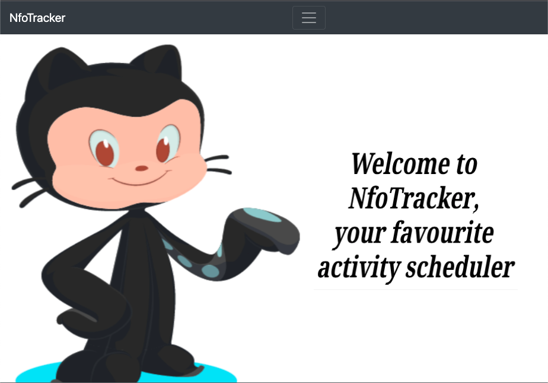
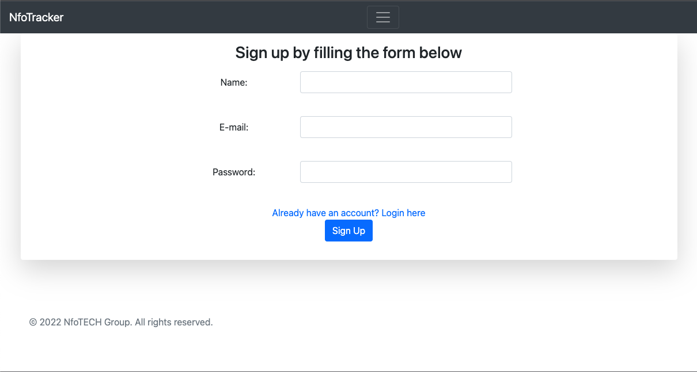
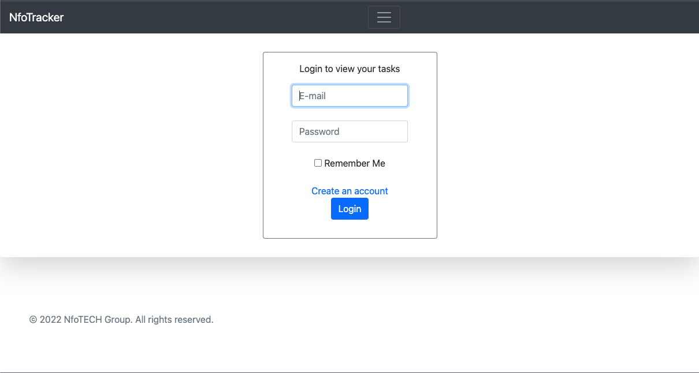
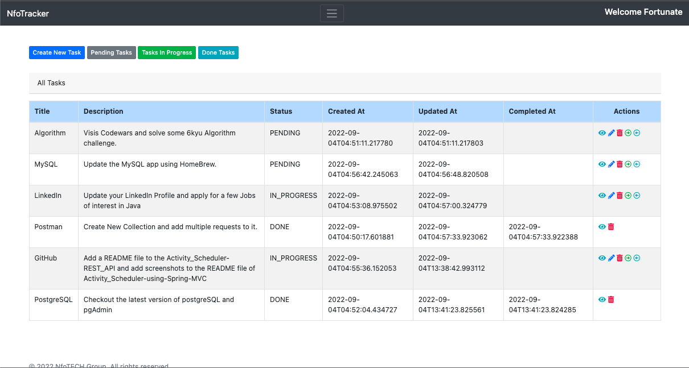
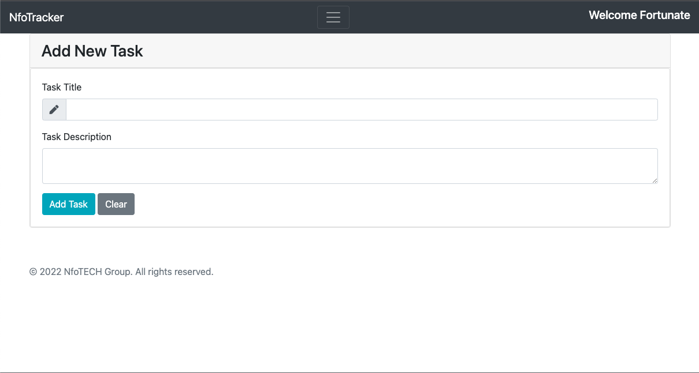
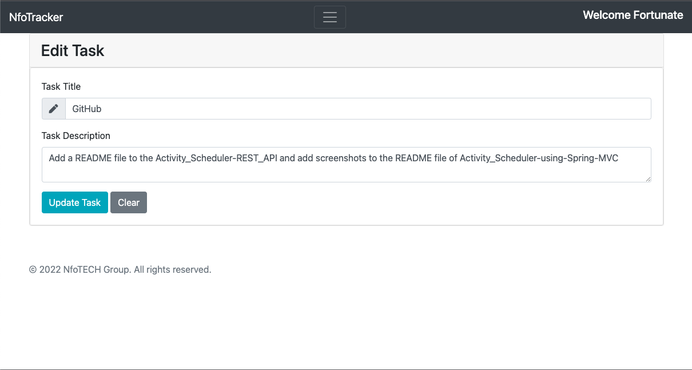
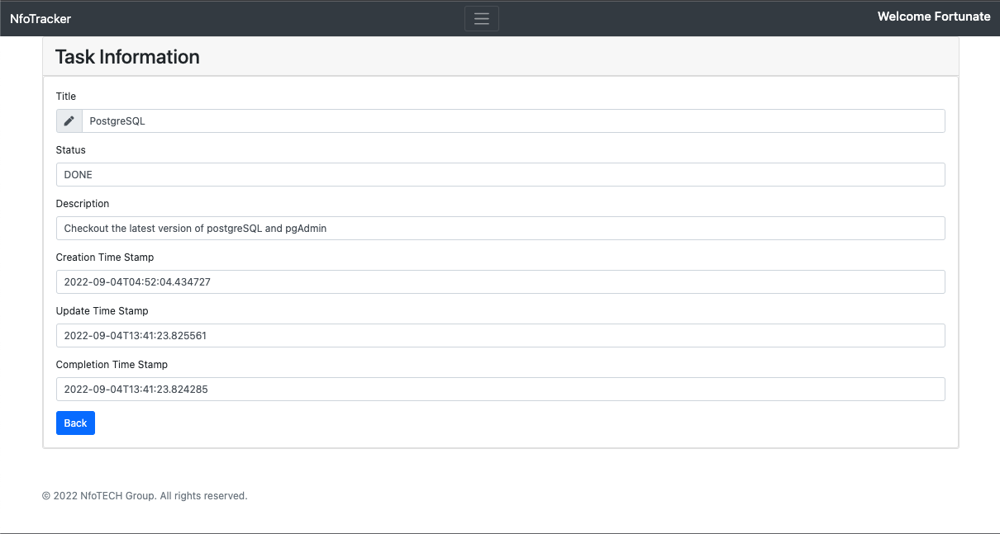
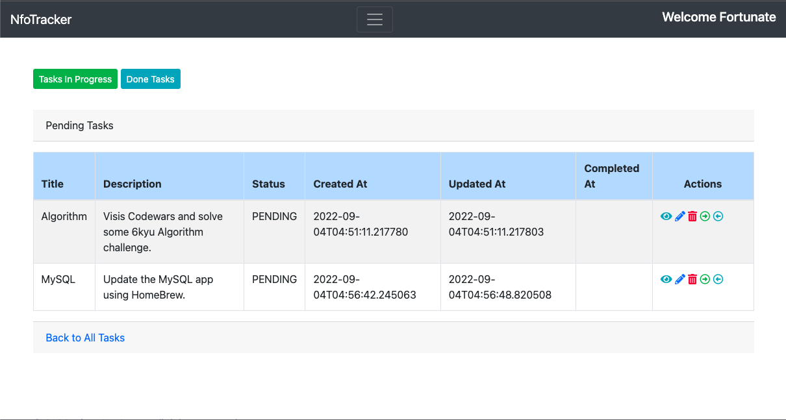
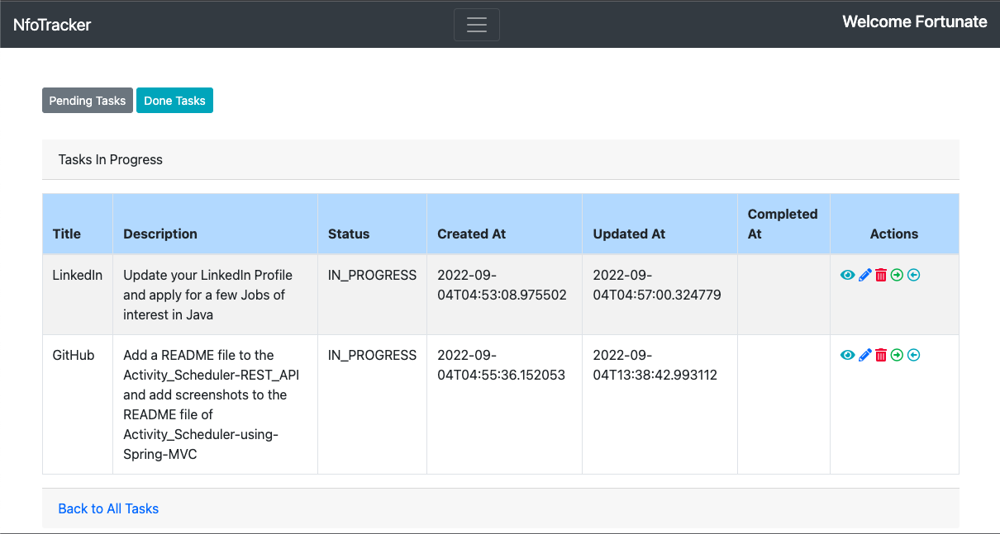
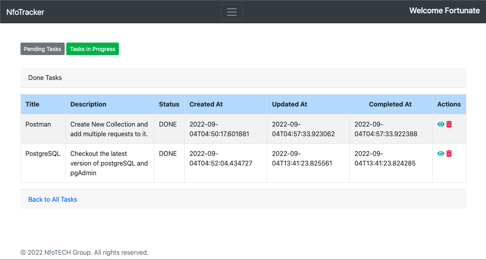

## ACTIVITY SCHEDULER

Activity Scheduler is a web application that allows users to create and manage their own schedules of activities.
### Tools

* Spring MVC 
* Thymeleaf 
* Git 
* Spring Data JPA 
* JUnit/Mockito 
* CSS
* PostgreSQL

### User Stories

As a user I should be able to

* Login 
* create a task.

A task should be made up of
* ® Title 
* ® Description 
* ® Status 
* ® Created At 
* ® Updated At 
* ® Completed At

A user should be able to 
  * View all tasks. 
  * View a particular task. 
  * View a particular task 
  * View all pending tasks. 
  * View all done tasks. 
  * View all in progress tasks. 
  * Move a task to done tasks. 
  * Move a task back to pending tasks from "in progress". 
  * Edit a task. 
    * Edit Title 
    * Edit Description
* Delete a task

## IMAGES OF THE APPLICATION

### HOME PAGE

### REGISTER PAGE

### LOGIN PAGE

### DASHBOARD PAGE

### ADD TASK PAGE

### EDIT TASK PAGE

### VIEW ALL TASKS PAGE

### VIEW ALL PENDING TASKS PAGE

### VIEW ALL IN PROGRESS TASKS PAGE

### VIEW ALL DONE TASKS PAGE

